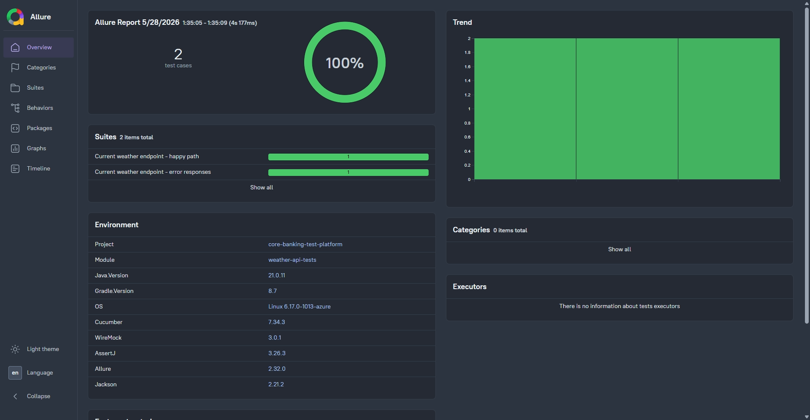
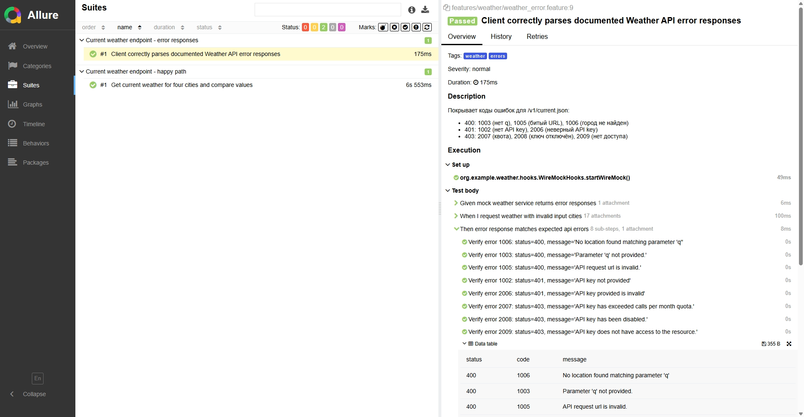
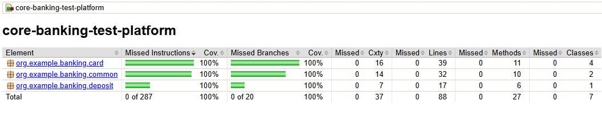

# core-banking-test-platform

[](https://github.com/ZhikharevAl/core-banking-test-platform/actions/workflows/ci.yml)
[](https://ZhikharevAl.github.io/core-banking-test-platform/)

Тестовая платформа из двух модулей:

- **Банковские продукты** (`src/main/java/org/example/banking/`) - карты, вклады, валидация, наследование. Покрыто unit-тестами JUnit 5.
- **Weather API tests** (`src/test/java/org/example/weather/`) - BDD-тесты сервиса погоды на Cucumber + WireMock + AssertJ. Внешний `api.weatherapi.com` нигде не вызывается, всё идёт через локально поднятые стабы.

## Оглавление

- [Запустить](#запустить)
- [Стек](#стек)
- [Архитектура](#архитектура)
    - [Task 1: Банковские продукты](#task-1---банковские-продукты-srcmainjavabanking)
    - [Task 2: Weather API tests](#task-2---weather-api-tests-srctestjavaweather)
- [Запуск](#запуск)
    - [Локально через Makefile](#локально-через-makefile)
    - [В Docker](#в-docker)
- [Allure](#allure)
    - [Локально](#локально)
    - [Что попадает в отчёт](#что-попадает-в-отчёт)
    - [Публикация в CI](#публикация-в-ci)
- [Тесты](#тесты)
    - [Структура](#структура)
    - [Покрытие Weather API](#покрытие-weather-api)
- [CI](#ci)
- [pre-commit](#pre-commit)


## Запустить

```bash
make docker-test          # checkstyle + tests + jacoco в контейнере, результаты в ./build
make allure-serve         # Allure UI на http://localhost:5050
```

Открой `http://localhost:5050/allure-docker-service/latest-report` - увидишь полный отчёт с двумя Cucumber-сценариями, environment и categories.




## Стек

- Java 21 (Temurin) + Gradle 8.7 (Kotlin DSL)
- JUnit 5 + JUnit Platform Suite
- Cucumber 7 (`java`, `junit-platform-engine`, `picocontainer` для DI между шагами)
- WireMock JRE8 standalone - стабы внешнего HTTP API
- Jackson Databind - JSON ⇄ records
- AssertJ - soft assertions с понятными диффами
- SLF4J Simple - логирование расхождений в stdout
- Allure 2.42 - отчёты + публикация в GitHub Pages
- Checkstyle 10.17 (custom config, в т.ч. правила именования тестовых классов/методов)
- JaCoCo 0.8.12 - HTML-отчёт покрытия
- Docker + Docker Compose - изолированный прогон и локальный Allure UI
- pre-commit - локальные хуки перед коммитом
- GitHub Actions - CI и публикация Allure-отчёта на gh-pages

## Архитектура

### Task 1 - Банковские продукты (`src/main/java/.../banking`)

```
common/
  BankingProduct          интерфейс: name, currency, balance
  AbstractBankingProduct  общая реализация + валидация
  CurrencyCode            enum поддерживаемых валют

card/
  CardProduct             интерфейс карточных операций
  AbstractCardProduct     базовая реализация
  DebitCard
  ForeignCurrencyDebitCard  специализация: запрет RUB
  CreditCard              + interestRate, currentDebt

deposit/
  DepositProduct          интерфейс депозитных операций
  Deposit                 + флаг закрытия, терминальное состояние
```

**Принципы:**

- **Контракты в интерфейсах.** Полиморфизм через `BankingProduct` / `CardProduct` / `DepositProduct` - клиентский код не зависит от конкретных классов.
- **Общая реализация в абстрактном базовом классе.** Валидация полей и мутации баланса - в `AbstractBankingProduct`, наследники не дублируют.
- **Расширяемость без правок.** Новый тип карты - наследник `AbstractCardProduct`. Новый тип вклада - реализация `DepositProduct`. Новая категория продукта (кредит наличными, инвестпродукт) - новый интерфейс рядом, наследующий `BankingProduct`.
- **Бизнес-правила в специализациях, а не в базе.** Запрет RUB у валютной карты живёт в `ForeignCurrencyDebitCard`. Логика долга - только в `CreditCard`.

### Task 2 - Weather API tests (`src/test/java/.../weather`)

Слоёная архитектура - каждый слой делает одну вещь, ни один не знает деталей соседнего:

```
api/                              транспорт + контракт
  WeatherApiClient                тонкий HTTP-клиент над JDK HttpClient
  WeatherEndpoint                 enum путей API (CURRENT/FORECAST/...)
  CurrentWeatherRequest           record-DTO запроса
  ApiCallResult                   обёртка над HttpResponse + URL
  WeatherResponseParser           изолированный Jackson-парсер (snake_case)
  WeatherApiClientException       доменное исключение

model/                            типизированные DTO ответа
  Location, Current, Condition, CurrentWeatherResponse, ApiError

wiremock/                         тестовая инфраструктура
  WireMockServerHolder            scenario-scoped экземпляр WireMockServer
  WeatherStubs                    декларативные стаб-билдеры

fixtures/                         наборы тестовых данных
  CurrentWeatherFixture           вход для стабов и ожидания позитива
  ApiErrorFixture                 вход для стабов негатива
  ErrorRequestCase                пара (город, код) для When-шага негатива
  ExpectedApiError                ожидание HTTP-ответа в Then-шаге негатива

hooks/
  WireMockHooks                   @Before/@After lifecycle

support/
  AllureAttachments               прицепляет request/response к Allure-шагам
  DataTableTypes                  конвертеры Cucumber DataTable → record-фикстуры
  Mismatches                      stdout-лог расхождений «ожидаемое vs фактическое»
  WeatherTestContext              состояние сценария (LinkedHashMap)

steps/                            тонкие Cucumber step definitions
  CurrentWeatherSteps             happy path
  WeatherErrorSteps               400/401/403

config/
  WeatherTestConfig               константы (API_KEY, timeout)

CucumberTestRunnerTests           JUnit Platform suite
```

**Архитектура:**

- **Степы не знают про HTTP, WireMock и JSON.** В `CurrentWeatherSteps`/`WeatherErrorSteps` нет ни одного `import java.net.http.*` или `ObjectMapper`. Только оркестрация: фикстура → стаб → клиент → DTO → AssertJ.
- **DI между шагами через `cucumber-picocontainer`.** `WireMockServerHolder`, `WeatherApiClient`, `WeatherStubs`, `WeatherTestContext`, `DataTableTypes` создаются один раз на сценарий и шарятся между хуками и степами без статиков и singleton-ов.
- **Парсинг DataTable идиоматичный.** `DataTableTypes` через `@DataTableType` превращает строки таблиц в типизированные records (`CurrentWeatherFixture`, `ApiErrorFixture`, `ErrorRequestCase`, `ExpectedApiError`). Степы получают `List<Fixture>` напрямую, без `Map<String, String>` и ручного парсинга.
- **Типизированные DTO вместо `JsonNode`.** `record CurrentWeatherResponse(Location location, Current current)` - компилятор ловит опечатки, рефакторинг безопасный. snake_case JSON маппится через `PropertyNamingStrategies.SNAKE_CASE` в одной точке (`WeatherResponseParser`).
- **Stubы декларативны.** Шаги передают `CurrentWeatherFixture` / `ApiErrorFixture`, а `WeatherStubs` знает, как из этого собрать WireMock-mapping. Формат стаба меняется в одном месте.
- **Soft assertions через AssertJ.** Все проверки в Then-шагах собираются в одной `SoftAssertions.assertSoftly(...)` - если упало tempC у Москвы и humidity у Парижа, в отчёте увидишь оба фейла, а не только первый.
- **Расхождения параллельно летят в stdout.** `Mismatches.report(key, field, expected, actual)` пишет `WARN [Moscow] tempC mismatch: expected=17.5, actual=21.0` в лог - это требование ТЗ продублировано рядом с Allure-проверками.
- **Allure-аттачменты автоматические.** `WeatherApiClient` дёргает `AllureAttachments.attachRequest/Response` в одну точку - в отчёте видно реальный URL и тело ответа без ручного логирования из степов.
- **Расширяемость.**


Существующие классы не трогаются.

## Запуск

### Локально через Makefile

```bash
make help            # все доступные команды
make ci              # checkstyle + tests + coverage (= что делает CI)
make test            # только тесты
make check           # только checkstyle
make coverage        # тесты + HTML-отчёт JaCoCo
make open-coverage   # то же + открыть отчёт в браузере
make clean           # очистить build/
```

Напрямую через Gradle:

```bash
./gradlew test
./gradlew checkstyleMain checkstyleTest
./gradlew test jacocoTestReport
```

HTML-отчёт покрытия после прогона: `build/jacocoHtml/index.html`.



### В Docker

Полный набор проверок изолированно, без локального JDK/Gradle:

```bash
make docker-test     # checkstyle + test + jacoco внутри контейнера, артефакты в ./build
make allure-serve    # поднять Allure UI на http://localhost:5050
make docker-allure   # обе предыдущие команды одной
make docker-down     # погасить allure-сервис
make docker-clean    # снести образы и volumes
```

**`Dockerfile`** - один stage поверх `gradle:8.7-jdk21`. Кэш Gradle живёт не в образе, а в named volume `gradle-cache` (см. `docker-compose.yaml`) - первый прогон скачает зависимости, последующие переиспользуют.

**`docker-compose.yaml`**:

- `tests` - собирает образ и прогоняет CI-набор от `${HOST_UID}:${HOST_GID}` (чтобы `./build/` оставался под твоим пользователем, без root-овых файлов). Лимиты: 2 GB / 2 CPU.
- `allure` - `frankescobar/allure-docker-service:2.27.0` на `:5050`. Слушает `./build/allure-results`, автогенерация каждые 3 секунды (`CHECK_RESULTS_EVERY_SECONDS: "3"`). Healthcheck по `/allure-docker-service/version`. Лимиты: 512 MB / 0.5 CPU. История прогонов в named volume `allure-history`.

В `Makefile` цель `docker-test` пробрасывает `HOST_UID`/`HOST_GID` автоматически:

```makefile
docker-test:
	HOST_UID=$(shell id -u) HOST_GID=$(shell id -g) $(COMPOSE) run --rm --build tests
```

## Allure

### Локально

```bash
make docker-test            # генерирует build/allure-results
make allure-serve           # http://localhost:5050
```

Поскольку `CHECK_RESULTS_EVERY_SECONDS: "3"`, после каждого нового прогона достаточно обновить страницу - сервис подхватит свежие результаты сам.

### Что попадает в отчёт

- **Categories** - кастомные группы из `src/test/resources/allure/categories.json`. Падения раскладываются по корзинам: «Infrastructure - WireMock», «API - Serialization / mapping», «API - HTTP server error 5xx», «Cucumber - glue / step definition», «Assertion error (Bug)» и т.д. Соглашение: `failed` - реальный баг (assertion упал, прод вернул не то), `broken` - тест сломался не из-за прода (NPE, инфра не поднялась).
- **Environment** (Overview) - версии Java, Gradle, Cucumber, WireMock, AssertJ, Allure, Jackson + ОС. Генерируется gradle-таской `writeAllureEnvironment` из реальных значений среды, не захардкожено.
- **Steps + Attachments** - у каждого HTTP-вызова в дереве шагов виден полный URL запроса и pretty-printed JSON ответа.

### Публикация в CI

`.github/workflows/ci.yml` имеет два job-а:

1. **`build`** - checkstyle + tests + jacoco, кладёт `allure-results` и `jacoco-html` как артефакты.
2. **`publish-allure-report`** - только из `main`, запускается даже при упавших тестах (`success() || failure()` - иначе не увидишь, что именно сломалось). Скачивает артефакт, ставит Allure CLI с официального GitHub Release, мержит с историей трендов из ветки `gh-pages`, генерирует свежий отчёт и публикует через `peaceiris/actions-gh-pages`.

**Что нужно настроить один раз вручную в GitHub:**

- Settings → Pages → Source: **Deploy from a branch**, ветка `gh-pages`, root `/`.
- Settings → Actions → General → Workflow permissions: **Read and write**.

После первого успешного прогона отчёт будет доступен по адресу:
`https://ZhikharevAl.github.io/core-banking-test-platform/`.

## Тесты

### Структура

```
src/test/java/org/example/banking/
  BankingProductArchitectureTests.java          архитектурные проверки полиморфизма
  card/
    DebitCardTests.java
    ForeignCurrencyDebitCardTests.java
    CreditCardTests.java
  common/
    AbstractBankingProductValidationTests.java  валидация конструктора и операций базы
  deposit/
    DepositTests.java

src/test/java/org/example/weather/
  CucumberTestRunnerTests.java                  JUnit Platform suite
  api/                                          транспорт и контракт
  model/                                        DTO ответа
  wiremock/                                     стаб-инфраструктура
  hooks/ steps/ support/ fixtures/ config/

src/test/resources/
  allure/
    categories.json                             кастомные группы для отчёта
  features/weather/
    current_weather.feature                     позитив (4 города)
    weather_error.feature                       400/401/403 - все 8 кодов из swagger
```

### Покрытие Weather API

| Status | Code | Что проверяется                                |
|--------|------|------------------------------------------------|
| 200    | -    | success: location + current                    |
| 400    | 1003 | Parameter 'q' not provided                     |
| 400    | 1005 | API request url is invalid                     |
| 400    | 1006 | No location found matching parameter 'q'       |
| 401    | 1002 | API key not provided                           |
| 401    | 2006 | API key provided is invalid                    |
| 403    | 2007 | API key has exceeded calls per month quota     |
| 403    | 2008 | API key has been disabled                      |
| 403    | 2009 | API key does not have access to the resource   |

ТЗ требовало 4 кода ошибок на выбор - покрыты **все 8 задокументированных**.

## CI

`.github/workflows/ci.yml`:

- Гоняет Checkstyle и тесты на каждом push + по ручному запуску (`workflow_dispatch`).
- Кэширует Gradle через `gradle/actions/setup-gradle` - feature-ветки на read-only кэше, чтобы не размывать общий.
- `concurrency` отменяет устаревшие запуски при пуше в ту же ветку.
- Складывает HTML-отчёт JaCoCo и `allure-results` как артефакты (доступны на вкладке Actions у запуска).
- На фейле дополнительно сохраняет отчёты Checkstyle и тестов.
- Из `main` ставит Allure CLI с GitHub Release и публикует отчёт с трендами на GitHub Pages.

## pre-commit

```bash
make precommit-install
make precommit-run
```

**Хуки:**

- trailing whitespace, EOF newline, YAML/XML/JSON sanity-check, mixed line endings
- check-added-large-files (порог 1 MB)
- check-merge-conflict
- detect-secrets - ловит случайные ключи/токены в коммитах
- `gradle checkstyleMain checkstyleTest` - те же правила, что в CI
- `gradle test` - полный прогон перед коммитом
